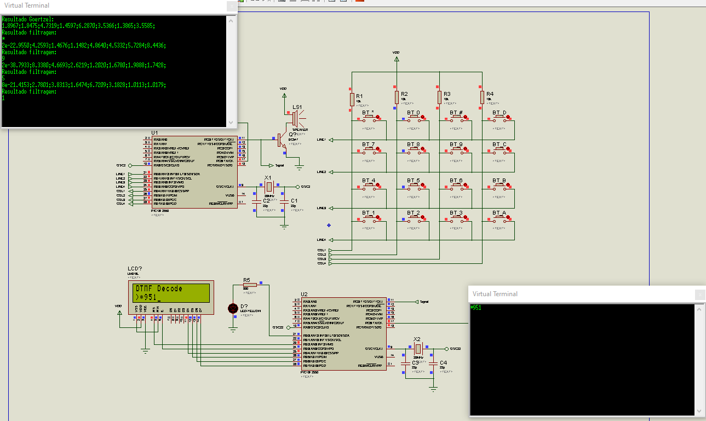
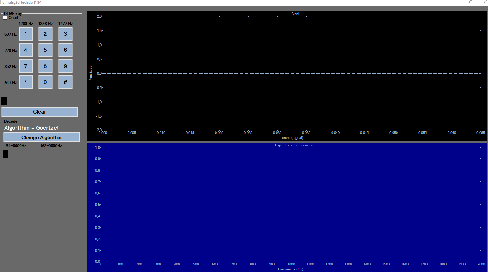

# Teclado-DTMF-Simulation: Simulador Didático de Teclado DTMF

## Descrição

Este repositório é dedicado a apresentar métodos para a implementação de um decodificador de teclado DTMF em microcontroladores, incluindo um simulador didático desenvolvido em C#. Nele, apliquei tanto o Algoritmo de Goertzel quanto o FFT radix-2 de Cooley-Tukey. O projeto, focado em fins educativos, é complementado por um [tutorial em pdf](Decodificador%20digital%20de%20tons%20DTMF.pdf) que explica a teoria e detalha a implementação.

### Histórico do Projeto

Originalmente desenvolvido em 2018 e revisado em 2022, este projeto foi atualizado para incluir melhorias no código C#, mantendo uma estrutura clara e didática.

## Instalação e Configuração

Para utilizar este simulador, siga as instruções abaixo:
1. Clone o repositório.
2. Instale o ambiente .NET Visual Studio (se necessário).
3. Navegue até a [pasta](./TecladoDTMF) do projeto e execute o arquivo de solução (.sln).

## Como Usar

### Software Simulador

Caso queira apenas utilizar o simulador está disponível em [simulador](./TecladoDTMF/bin/Debug).

Após a instalação, você pode começar a usar o simulador da seguinte maneira:
1. Abra o projeto no seu ambiente de desenvolvimento.
2. Execute o simulador para ver o decodificador DTMF em ação.
3. Experimente com diferentes entradas para entender como o decodificador processa sinais DTMF.

### Simulação com PIC

A simulação como microcontroladores PIC foi implementada utilizando MikroC e o software de circuitos Proteus.

## Exemplos de Uso

### Simulação em circuito

### Simulação em software

## Como Contribuir

Contribuições são sempre bem-vindas! Se você tem uma ideia para melhorar o projeto, por favor:

1. Faça um fork do repositório.
2. Crie uma branch para sua feature: `git checkout -b nova-feature`.
3. Faça suas alterações e commit: `git commit -am 'Adiciona alguma feature'`.
4. Envie para a branch: `git push origin nova-feature`.
5. Envie um pull request.

## Licença

Este projeto está sob a licença [LICENSE](LICENSE). Veja o arquivo LICENSE para mais detalhes.
